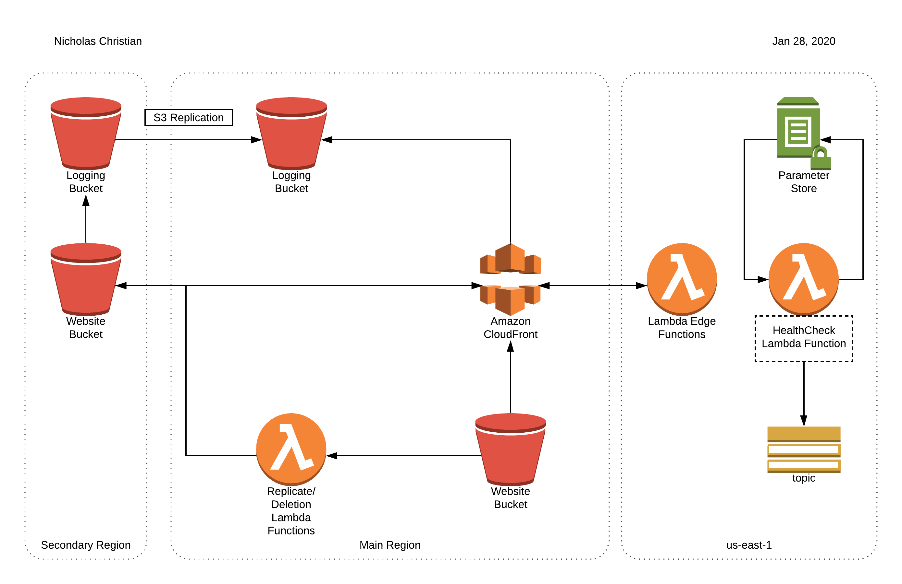

# serverless-website-refarch-cloudformation

This project aims to help deploy a basic multi-region, fault-tolerant. ready-to-use serverless website that mainly uses Amazon CloudFront, Amazon S3, and AWS Lambda.

## Overview

### Template Details

| Template                            | Description                                                  |
| ----------------------------------- | ------------------------------------------------------------ |
| website-primary-logging-bucket.yaml | Creates a logging bucket in the main chosen region to ultimately be used for the central location for all S3 and CloudFront logs. |
| website-operations.yaml             | Creates the lambda edge functions for CloudFront, creates the SNS topic to alert on a Route53 healthcheck failure, and creates a lambda function that checks the status of all relevent healthchecks. |
| website-secondary.yaml              | Creates a regional public website bucket as a fallback for CloudFront and a regional logging bucket that replicates all logs to the primary logging bucket. |
| website-primary.yaml                | Creates a CloudFront distrubution, a public website bucket, as well as replication and deletion lambda functions that mirrors the files in the primary website bucket with the secondary website bucket. |

### Tagging Stratagy 

| Tag             | Description                                                  |
| --------------- | ------------------------------------------------------------ |
| Application     | The application these resources are for.                     |
| ApplicationRole | The function in the application the resource has. Used to understand what the resource is for. |
| Business Unit   | The person/team/group these resources belong to.             |
| Confidentiality | Used to identify how sensitive the resource is. Values are 'Sensitive Non-Public', 'Non-Public', and 'Public'. |
| Environment     | The environment these resources belong to. Example would be dev, test, stage, or prod. |
| Name            | The name of the resource.                                    |
| PoC             | Person of Contact. The person/group that will be contacted for these resources. |

## How to use

These templates are designed to be deployed per environment. The defaults are dev, test, stage, and prod, but may be changed in the config file. The values in the config file must be populated before deployment.

### Config

| Variable                | Description                                                  |
| ----------------------- | ------------------------------------------------------------ |
| ACMCERTIFICATIONARN     | The ACM Certification ARN that has the domain and any subdomains that will be used. |
| APPLICATION             | Used for tagging and naming purposes. The name of the application these resources belong to. |
| BUSINESSUNIT            | Used for tagging purposes. The person/team/group these resources belong to. |
| DOMAINNAME              | The domain for the website.                                  |
| HOSTEDZONEID            | The Route53 hosted zone of the domain name.                  |
| POC                     | Used for tagging purposes and operational purposes. Lets people know who to contact for these resources and also who the SNS topic will subscribe. |
| REGION                  | The main region that the primary stacks will be deployed to. |
| SECONDARY_REGION        | The region that the secondary stacks will be deployed to.    |
| PRIMARY_LAMBDA_BUCKET   | A S3 bucket that's in the main region for the replication and deletion lambda function packages will be stored or deployment. |
| US_EAST_1_LAMBDA_BUCKET | A S3 bucket that's in us-east-1 for the healthcheck lambda function package will be stored for deployment. |

### Commands

From the root directory of this projects, commands can be ran. Each command takes the environment argument through `-e`.

#### All

Packages and uploads the lambda functions to the respective buckets, and deploys the CloudFormation templates.

` 	./all -e ENVIRONMENT`

#### Delete

Attempts to delete all deployed stacks. Some resources will need to be cleaned up manually. All S3 buckets will need to cleaned up manually due to the contents within. 

Lambda Edge functions have a wait period before they can be deleted if they were associated with. 

Once the S3 buckets are cleaned up and enough time has passed the delete command can be ran again in order to delete the stacks.

`./delete -e ENVIRONMENT`

#### Deploy

Deploys the CloudFormation templates.

`./deploy -e ENVIRONMENT`

#### Upload-Lambdas

Packages and health-check uploads the lambda functions to the respective buckets.

`./upload-lambdas -e ENVIRONMENT`

## Further Cleanup

The healthcheck lambda functions creates SSM Parameters in order to store the state of the Route53 healthchecks. These are stored in us-east-1 and will need to be deleted manually.

The Lambda packages that have been uploaded to the designated S3 buckets will need to be deleted manually.

## Notes 

* CloudFront may take awhile to be functional, and may redirect to the S3 URL, resulting in an access denied. 

* Website contents should only be uploaded to the primary website bucket.
* Additional functionality can be added to CloudFront by using Lambda Edge Functions. [Examples can be found here.](https://docs.aws.amazon.com/AmazonCloudFront/latest/DeveloperGuide/lambda-examples.html) The current Lambda Edge function is used to generate HTTP headers for security and should be adapted.

